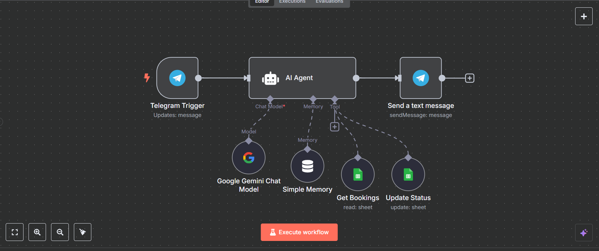

# Booking Buddy

Booking Buddy is a conversational AI assistant that connects Kenyan customers with local service providers (plumbers, electricians, cleaners, etc.) through natural, friendly interactions via Telegram. It streamlines the process of finding, booking, and paying for local services, making it easy for both clients and providers.

---

## Features

- **Conversational Booking:** Users interact with Booking Buddy via Telegram to request services, confirm bookings, and make payments.
- **Provider Search:** Finds relevant, available service providers by type and location.
- **Booking Management:** Collects all necessary booking details and confirms with both client and provider.
- **M-PESA Integration:** Securely initiates STK push payments for bookings.
- **Provider Portal:** Service providers can view, accept, or decline booking requests via Telegram.
- **Google Sheets Integration:** Bookings are logged for tracking and management.
- **Error Handling:** Graceful handling of edge cases, payment failures, and missing information.

---

## Tech Stack

- **Node.js** with **Express** for the backend API
- **MongoDB** with **Mongoose** for data storage
- **n8n** for workflow automation and Telegram bot integration
- **Google Sheets** for booking records
- **M-PESA** for payment processing
- **dotenv** for environment variable management

---

## Getting Started

### Prerequisites

- Node.js and npm installed
- MongoDB database (local or Atlas)
- n8n account for workflow automation
- Telegram bot token
- M-PESA API credentials

### Installation

1. **Clone the repository:**
   ```sh
   git clone <your-repo-url>
   cd Booking_Buddy
   ```

2. **Install dependencies:**
   ```sh
   npm install
   ```

3. **Set up environment variables:**
   - Create a `.env` file in the root directory.
   - Add your MongoDB URI, M-PESA credentials, Telegram bot token, and other required variables.

4. **Start the development server:**
   ```sh
   npm run dev
   ```
   Or for production:
   ```sh
   npm start
   ```

5. **Set up n8n workflows:**
   - Import the provided JSON files in `Agents Workflows/` into your n8n instance.
   - Configure credentials for Telegram, Google Sheets, Airtable, and M-PESA as needed.

---

## Usage

- **Clients:** Interact with the Booking Buddy Telegram bot to request and pay for services.
- **Providers:** Use the Provider Telegram bot to manage incoming booking requests.
- **Admins:** Monitor bookings via Google Sheets and manage providers in the database.

---

## Project Structure

```
Booking_Buddy/
  ├── Agents Workflows/         # n8n workflow JSONs for client and provider bots
  ├── config/                   # Configuration files
  ├── controllers/              # Express controllers (e.g., M-PESA)
  ├── middlewares/              # Express middlewares
  ├── models/                   # Mongoose models (Booking, Provider)
  ├── routes/                   # Express route definitions
  ├── utils/                    # Utility functions
  ├── server.js                 # Main Express server entry point
  ├── package.json
  └── README.md
```

---

## Screenshots & Demos

### n8n Workflow Overviews


*Booking Buddy - Client n8n Workflow*


*Booking Buddy - Provider n8n Workflow*

---

## Telegram Bots

- **Client Bot:** [@booking_mate_bot](https://t.me/booking_mate_bot)
- **Provider Bot:** [@booking_buddy_providers_bot](https://t.me/booking_buddy_providers_bot)

---

### Booking Demo


*Booking process demo (step 1)*


*Booking process demo (step 2)*

---

## Environment Variables

Example `.env` file:

```
MONGODB_URI=your_mongodb_uri
MPESA_BUSINESS_SHORTCODE=your_shortcode
MPESA_PASSKEY=your_passkey
MPESA_ENVIRONMENT=sandbox
MPESA_CALLBACK_URL=https://yourdomain.com/api/payments
TELEGRAM_BOT_TOKEN=your_telegram_token
PORT=3000
```

---

## Data & Integrations

- **Google Sheets (Bookings Log):** [View Sheet](https://docs.google.com/spreadsheets/d/14dTcLprXXElZAhbC4OGUyXeq0uTDRlrczcvlR1HLK-c/edit?usp=sharing)
- **Airtable Providers Table:** [View Table](https://airtable.com/appGs32Hc5KqYGaSs/shrFsT6DYu0Db86Hj)

---

## Contributing

If you'd like to contribute to the project, please follow these steps:

1. **Fork the repository:**
   ```sh
   git clone <your-repo-url>
   cd Booking_Buddy
   git checkout -b feature-branch
   ```

2. **Create a new branch:**
   ```sh
   git checkout -b feature-branch
   ```

3. **Make your changes and commit:**
   ```sh
   git add .
   git commit -m "Added new feature"
   ```

4. **Push your changes:**
   ```sh
   git push origin feature-branch
   ```

5. **Create a pull request:**
   - Go to the repository on GitHub.
   - Click on "Pull requests"
   - Click on "New pull request"
   - Select your feature branch
   - Add a title and description for your pull request
   - Click "Create pull request"

---

## License

This project is licensed under the MIT License. See the [LICENSE](LICENSE) file for more details.git 